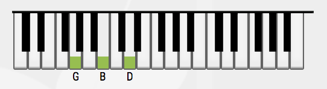
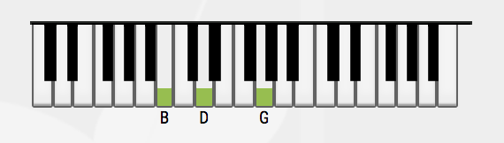
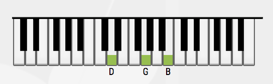

# Chord Kata - Episode One

**tl;dr;**
  
    The purpose of this kata is to create an application which can determine the notes for a music chord based on its notation.

    For instance, when asked for a C major chord, it should return the following note : C, E and G.

**Longer version**

Before we start, it's important the precise that we will work on a **diatonic scale**, which is fairly common in the western music scales.

This musical scale is base on 7 notes : C - D - E - F - G - A - B

Each note is separated by two **halftones** (two halftones equals a tone) except between E and F, and B and A where there is only one halftone.

## Step One - Determine the related notes

For each note of the scale, we can determine related notes that will help us to build a chord. Thoses notes are called third, fifth, sixth, seventh (and others).

Before we start composing chords, we need to determine at least the third and the fifth which will allow us to compose major and minor chords.

    Test list (for example):
    [ ] Based on a root note, i can determine which note is the third
    [ ] Based on a root note, i can determine which note is the fifth
    
    Bonus :
    I can also determine the third minor

| Root | 3rd (+4 halftones)    | 5th (+7 halftones)    |
|------|--------|---------|
|  C   |  E     |  G      |
|  D   |  F#/Gb |  A      |
|  E   |  G#/Ab |  B      |
|  F   |  A     |  C      |
|  G   |  B     |  D      |
|  A   |  C#/Db |  E      |
|  B   |  D#/Eb |  F#/Gb  |

## Step Two - Compose major and minor chords

Once we can determine the basic related notes from a root note, we can start building chords. A chord is the musical notation to describe the sound resulting of the superposition of multiple notes played - to simplify - simultinously.

A major chord is the sum of three notes that we have already seen : the root, the third and the fifth.

    Test list (for example):
    [ ] The C major chord should be composed of C, E and G
    [ ] The A major chord should be composed of A, C#/Db and E

A minor chord is the sum of three notes : the root, the **third minor** and the fifth.

    Test list (for example):
    [ ] The C minor chord should be composed of C, D#/Eb and G
    [ ] The A minor chord should be composed of A, C and E

## Step Three - Inverted chords

If a chord is always named after the **root** note and the modification(s) applied on it (minor, seventh, augmented or diminished, ...), it is not necessarily played in that exact order.

For example, to play an **G** major chord on a piano would mean that we play the **G**, **B**  and **D** notes simultinously.
It would also mean that the **G** note would be the lowest-pitch note and the **D** the highest-pitch.

But, respect this order is not mandatory and you can perfectly change the notes order without changing the chord played. It may change slightly the sound produced, but not the chord.

If you change a chord's note order, the position obtained is what's called an **inversion**.

The first inversion is a chord where the third is the lowest-pitch. For a **G** chord, the notes played would be **B**, **D** and **G**.

The second inversion is a chord where the fifth is the lowest-pitch. Again, for the **G** chord, the notes would be played in that order : **D**, **G** and **B**

## Step Four - Make the music easier

From all we have already done, we should be able to simplify the following chord progression.

--------------------------

C -> F -> D -> G

Tierce => Majeur (2 tons) / Mineur (1.5 ton)

Full table :

| Root | +1       | +2      | +3     | +4 (third) | +5      | +6      | +7      | +8      | +9      | +10     | +11     |
|------|----------|---------|--------|------------|---------|---------|---------|---------|---------|---------|---------|
|  C   |  C#/Db   |  D      |  D#/Eb |  E         |  F      |  F#/Gb  |  G      |  G#/Ab  |  A      |  A#/Bb  |  B      |
|  D   |  D#/Eb   |  E      |  F     |  F#/Gb     |  G      |  G#/Ab  |  A      |  A#/Bb  |  B      |  C      |  C#/Db  |
|  E   |  F       |  F#/Gb  |  G     |  G#/Ab     |  A      |  A#/Bb  |  B      |  C      |  C#/Db  |  D      |  D#/Eb  |
|  F   |  F#/Gb   |  G      |  G#/Ab |  A         |  A#/Bb  |  B      |  C      |  C#/Db  |  D      |  D#/Eb  |  E      |
|  G   |  G#/Ab   |  A      |  A#/Bb |  B         |  C      |  C#/Db  |  D      |  D#/Eb  |  E      |  F      |  F#/Gb  |
|  A   |  A#/Bb   |  B      |  C     |  C#/Db     |  D      |  D#/Eb  |  E      |  F      |  F#/Gb  |  G      |  G#/Ab  |
|  B   |  C       |  C#/Db  |  D     |  D#/Eb     |  E      |  F      |  F#/Gb  |  G      |  G#/Ab  |  A      |  A#/Bb  |
